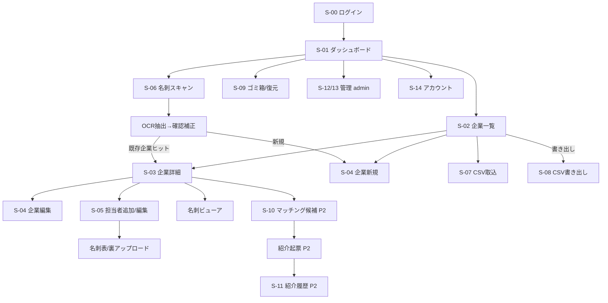

# 画面設計書 — 大吉会計 顧客管理 + ビジネスマッチング

- **版**: 0.1（ドラフト）
- **最終更新**: 2026-06-18
- **位置づけ**: `docs/requirements.md`（要件定義 v0.3）を正とし、画面構成・遷移・各画面のUXを具体化する。
  併せて **§8 不足機能の洗い出し（Gap Analysis）** を行い、要件に反映すべき項目を提示する。
- **次ステップ**: 本書合意後、主要画面を Figma でビジュアル化（デザイン方向性は別途決定）。

---

## 1. 設計方針（UX原則）

- **少人数・全員共有・実用最優先。** 役割は staff / admin の2種。表示の出し分けはUX、強制力は RLS＋DAL（SEC-4/SEC-7）。
- **モバイル必須。** 名刺は外出先でスマホ撮影 → レスポンシブ前提。名刺スキャンはカメラ起動に対応。
- **日本語UI**（i18nは当面不要）。
- **最小操作。** 破壊的操作（削除・取込確定）だけ確認を挟む。論理削除なので「削除＝ゴミ箱へ」。
- **状態を必ず設計する。** 各画面に「空 / 読込中 / エラー / 権限なし」を定義。
- **機微情報の配慮。** 名刺画像は署名URLでのみ表示（SEC-9）。一覧やログに個人情報を出しすぎない。

---

## 2. 画面一覧

| ID | 画面 | パス（想定） | フェーズ | 権限 | 目的 |
|---|---|---|---|---|---|
| S-00 | ログイン / パスワードリセット | `/login`, `/reset-password` | 0/1 | 全員 | 認証 |
| S-01 | ダッシュボード（ホーム） | `/` | 1 | staff | ログイン後の着地。要約と主要導線 |
| S-02 | 企業一覧 | `/companies` | 1 | staff | 検索・絞り込み・CSV・新規導線 |
| S-03 | 企業詳細（担当者一覧含む） | `/companies/[id]` | 1 | staff | 企業情報＋担当者＋名刺＋（P2:紹介/マッチング） |
| S-04 | 企業 新規/編集 | `/companies/new`, `/companies/[id]/edit` | 1 | staff | 企業の登録・編集 |
| S-05 | 担当者 新規/編集（名刺画像） | `/companies/[id]/contacts/new`, `/contacts/[id]/edit` | 1 | staff | 担当者登録＋名刺表/裏アップロード |
| S-06 | 名刺スキャン→顧客作成（OCR） | `/scan` | 1→1.5 | staff | 撮影/アップロード→OCR→確認補正→企業＋担当者作成 |
| S-07 | CSV取込 | `/companies/import` | 1 | staff | 検証→エラー提示→確定取込（企業単位） |
| S-08 | CSV書き出し（ダイアログ） | （S-02内） | 1 | staff | 絞り込み結果を安全に書き出し |
| S-09 | ゴミ箱 / 復元 | `/trash` | 1 | staff | 論理削除済みの閲覧・復元（物理削除はadmin例外） |
| S-10 | マッチング候補 | `/companies/[id]/matching`, `/matching` | 2 | staff | 起点企業の紹介候補をスコア順表示 |
| S-11 | 紹介履歴 | `/referrals` | 2 | staff | 紹介の記録・ステータス更新 |
| S-12 | 管理: ユーザー | `/admin/users` | 1〜2 | admin | スタッフ招待/無効化 |
| S-13 | 管理: タグ/業種マスタ | `/admin/tags`, `/admin/masters` | 1〜2 | admin | タグ名寄せ・業種マスタ編集 |
| S-14 | アカウント | `/account` | 1 | staff | プロフィール・パスワード変更・ログアウト |
| 共通 | 名刺ビューア（モーダル）/ 確認ダイアログ / トースト / 403 / 404 | — | 1 | — | 横断UI |

---

## 3. 共通レイアウト / ナビゲーション

```
┌───────────────────────────────────────────────────────────┐
│ [大吉CRM]   🔍 検索…            ＋新規  📷名刺スキャン   👤▾ │  ← ヘッダ
├──────────┬────────────────────────────────────────────────┤
│ ⌂ ホーム  │                                                │
│ 🏢 顧客   │            （各画面のコンテンツ）                │
│ 🔗 マッチ │                                                │  ← サイドナビ
│ 🤝 紹介   │                                                │     (P2項目は淡色)
│ 🗑 ゴミ箱 │                                                │
│ ⚙ 管理*   │                                                │     *adminのみ表示
└──────────┴────────────────────────────────────────────────┘
モバイル: サイドナビ→ハンバーガー or 下部タブ（ホーム/顧客/スキャン/紹介/その他）
```

- ユーザーメニュー（👤▾）: アカウント、ログアウト。
- 「📷名刺スキャン」はヘッダ常設（主要な入口のため）。
- 横断UI: トースト通知 / 破壊的操作の確認ダイアログ / グローバルローディング / 空状態 / 403（権限なし）/ 404。

---

## 4. 画面遷移図



---

## 5. 各画面の詳細

各画面の記法: **目的 / レイアウト / 要素 / 状態 / 操作・遷移 / 権限 / 対応FR**

### S-00 ログイン / パスワードリセット
- **目的**: Supabase Auth でメール+パスワード認証。
- **要素**: メール、パスワード、ログイン、パスワードを忘れた方（→ リセットメール送信）。
- **状態**: 認証エラー（資格情報不正）、送信中、リセットメール送信済み。
- **遷移**: 成功→S-01。未ログインで保護ページへ来たら→S-00（戻り先を保持）。
- **権限**: 未認証のみ。認証済みは S-01 へ。
- **FR**: FR-A1, FR-A2, FR-A3。

### S-01 ダッシュボード（ホーム）
- **目的**: ログイン後の着地点。主要導線と件数サマリ。
- **要素**: クイックアクション（＋企業新規 / 📷名刺スキャン / CSV取込）、件数（企業数・見込み・直近追加）、最近更新した企業、（P2: 今週の注目マッチング / 進行中の紹介）。
- **状態**: 空（初回＝データ0 → オンボーディング誘導「最初の顧客を登録/名刺をスキャン」）、読込中。
- **権限**: staff。`owner` で「自分担当」フィルタの初期表示は任意。
- **FR**: 横断（要件に明記なし → §8 で追加提案）。

### S-02 企業一覧
- **目的**: 検索・絞り込み・一括操作の中心。
```
┌ 企業一覧 ───────────────────────────── ＋新規  📥CSV取込  📤書き出し ┐
│ 🔍 フリーワード(社名/メモ)                                            │
│ [種別▾][業種▾][エリア▾][規模▾][ステータス▾] needs:[タグ…] offers:[タグ…] [絞込ｸﾘｱ] │
├──────────────────────────────────────────────────────────────────┤
│ □ 社名         種別  業種   エリア  ステータス  needs/offers   更新日 │
│ □ 株式会社A    企業  飲食   東京都  顧問中     集客 / 食材卸   06/18 │
│ □ B商店        個人  小売   大阪    見込み     仕入先 / —     06/17 │
│ …（ページング / 件数表示 / 並び替え: 更新日・社名）                   │
└──────────────────────────────────────────────────────────────────┘
```
- **要素**: 検索バー、複合フィルタ（type/industry/area/size/status/needs/offers、AND）、結果テーブル、行クリックで S-03、選択チェック（一括操作余地）、ページング・並び替え、件数表示。
- **状態**: 空（条件ヒット0 / 全体0）、読込中、エラー、絞り込み適用中バッジ。
- **遷移**: 行→S-03、＋新規→S-04、CSV取込→S-07、書き出し→S-08。
- **権限**: staff（全件）。
- **FR**: FR-C2, FR-C6, FR-S3。

### S-03 企業詳細（担当者一覧を含む）
- **目的**: 1企業の全体ビュー。企業情報＋担当者＋名刺＋（P2: マッチング/紹介）。
```
┌ 株式会社A  [企業] [顧問中]               ✎編集  ⋯(🗑ゴミ箱へ / 複製) ┐
│ 業種:飲食  エリア:東京都  規模:1千万〜5千万  社内担当:山田          │
│ needs: 集客, 資金調達     offers: 食材卸                            │
│ メモ: …            extra: {…}（折りたたみ）                         │
├ 担当者 ───────────────────────────────────── ＋担当者を追加 ───────┤
│ 👤 佐藤 太郎  営業部長  sato@…  03-…   [名刺🖼表/裏]  ✎ 🗑          │
│ 👤 鈴木 花子  …                                                    │
├ （P2）マッチング候補  ▶  / 紹介履歴 ▶                               │
└────────────────────────────────────────────────────────────────┘
```
- **要素**: 企業ヘッダ（種別/ステータスのバッジ）、コア項目、タグ（needs/offers）、extra（折りたたみ）、担当者カード一覧（名刺サムネ→ビューア）、編集/ゴミ箱導線、（P2: マッチング・紹介タブ）。
- **状態**: 担当者0（「担当者を追加」促し）、名刺なし、読込中、404（存在しない/削除済み）。
- **遷移**: 編集→S-04、担当者追加→S-05、名刺→ビューア、（P2）→S-10/S-11。
- **権限**: staff。
- **FR**: FR-C3, FR-P1, FR-P2, FR-C7, FR-R3(P2)。

### S-04 企業 新規/編集
- **目的**: 企業の登録・編集。
- **要素**: type（企業/個人事業主・必須）、name（必須）、industry（業種マスタ選択）、area（都道府県選択）、size（規模区分選択）、status、owner（社内担当・任意）、needs/offers（タグ入力＝マスタ補完＋自由追加）、notes、extra（キー追加可）。
- **バリデーション**: 必須チェック、マスタ整合（業種/エリア/規模/種別）、未知タグは確認の上マスタ追加。
- **状態**: 入力エラー（フィールド単位）、保存中、保存成功（トースト→S-03）。
- **権限**: staff。
- **FR**: FR-C1, FR-C4, FR-C7, FR-T1, FR-T2, FR-M5。

### S-05 担当者 新規/編集（名刺画像アップロード）
- **目的**: 企業配下に担当者を登録し、名刺の表/裏画像を保存。
```
┌ 担当者を追加（株式会社A）─────────────────────────────────────┐
│ 氏名* [        ]  フリガナ [        ]  □主担当                  │
│ 役職 [      ] 部署 [      ]  メール [      ] 電話 [    ] 携帯 [  ]│
├ 名刺画像 ─────────────────────────────────────────────────────┤
│  表面: [ 📷撮影 / 📁ファイル ]  [プレビュー]                     │
│  裏面: [ 📷撮影 / 📁ファイル ]  [プレビュー]                     │
│  ※画像は安全に保管（署名URLで表示）。OCRで自動入力したい場合→📷名刺スキャン │
└──────────────────────────────────── [キャンセル] [保存] ───────┘
```
- **要素**: 担当者フォーム、名刺 表/裏アップロード（カメラ/ファイル）、プレビュー、主担当フラグ。
- **状態**: アップロード中/失敗（リトライ）、画像差し替え、保存中、バリデーション（メール/電話形式）。
- **遷移**: 保存→S-03。OCR利用導線→S-06。
- **権限**: staff。
- **FR**: FR-P1, FR-P2, FR-P6。

### S-06 名刺スキャン→顧客作成（OCR）
- **目的**: 名刺撮影/アップロード → ブラウザ内OCR(Tesseract.js) → 確認・補正 → 企業＋担当者作成。
```
┌ 名刺スキャン ─────────────────────────────────────────────────┐
│ 1) 取り込み:  [📷カメラ起動]  または  [📁ファイル選択]           │
│    表面: [プレビュー/トリミング・回転]   裏面(任意): [プレビュー] │
│ 2) [OCRで読み取る]   …解析中 ▓▓▓▓░░ (ブラウザ内処理)            │
│ 3) 抽出結果の確認・補正（左:名刺画像 / 右:フォーム）             │
│    会社名[株式会社A] 氏名[佐藤太郎] 役職[営業部長]              │
│    メール[sato@…] 電話[03-…] 住所[…] URL[…]                    │
│    ▸ 業種/エリア/規模/needs/offers は手動選択（任意）           │
│    ⚠ 既存企業候補: 「株式会社A」が見つかりました → [既存に担当者追加]/[新規作成]│
└──────────────────────── [やり直す] [この内容で作成] ───────────┘
```
- **要素**: 取込（カメラ/ファイル、表/裏）、前処理（トリミング/回転/グレースケール）、OCR実行（進捗）、抽出結果フォーム（画像と並べて補正）、**既存企業の重複検出**（社名/メール一致→既存に担当者追加 or 新規）、作成。
- **状態**: OCR処理中/失敗（手動入力にフォールバック）、低信頼フィールドのハイライト、重複ヒット/なし。
- **遷移**: 新規作成→S-03、既存に追加→該当S-03。
- **権限**: staff。
- **FR**: FR-P3, FR-P4, FR-P5, FR-P6, §6.5.1。

### S-07 CSV取込
- **目的**: 企業を一括取込（検証→エラー提示→確定）。
- **要素**: テンプレDLリンク、ファイル選択、プレビュー（先頭N行）、検証結果（行番号・列・エラー理由、未知タグ/マスタ外値の扱い）、確定取込、結果サマリ（成功/スキップ件数）。
- **状態**: 検証中、検証NG（取込不可行の一覧）、部分成功の扱い（全件OKのみ確定 or 正常行のみ取込＝要件で確認）、完了。
- **権限**: staff。
- **FR**: FR-S1, FR-S2, FR-S5, SEC-6。

### S-08 CSV書き出し（ダイアログ）
- **目的**: 現在の絞り込み結果を安全に書き出し。
- **要素**: 範囲（現フィルタ/全件）、列確認、文字コード（UTF-8 BOM）、論理削除除外の注記、ダウンロード。
- **安全**: フォーミュラインジェクション対策の明示（自動エスケープ）。
- **FR**: FR-S3, FR-S4, SEC-6。

### S-09 ゴミ箱 / 復元
- **目的**: 論理削除済み（`deleted_at`）の企業/担当者を確認・復元。
- **要素**: 削除済み一覧（削除日・削除者があれば）、復元、（admin）完全削除。
- **状態**: 空、読込中。
- **権限**: staff（復元）、admin（完全削除）。
- **FR**: FR-C5, FR-P7（→ 復元UIは要件未記載 / §8で追加提案）。

### S-10 マッチング候補（P2）
- **目的**: 起点企業に対する紹介候補をスコア順表示。
- **要素**: 起点企業、候補リスト（相手企業・スコア・**重なったタグと方向**＝協業先紹介/顧客紹介）、しきい値/並び替え（v2）、「紹介を起票」ボタン。
- **状態**: 候補0、読込中。
- **遷移**: 起票→紹介作成→S-11。
- **FR**: FR-M1〜M5, FR-R4。

### S-11 紹介履歴（P2）
- **目的**: 紹介の記録とステータス追跡。
- **要素**: 一覧（from/to企業・kind・根拠タグ・status・起票者・日付）、ステータス更新（提案→打診中→成立/不成立）、フィルタ、企業詳細からの関連表示。
- **FR**: FR-R1, FR-R2, FR-R3。

### S-12 管理: ユーザー（admin）
- **目的**: スタッフの招待/無効化。
- **要素**: ユーザー一覧、招待（メール）、無効化、ロール表示。
- **権限**: admin のみ（非adminは403）。
- **FR**: FR-A4（実装範囲は §12 で要確認）。

### S-13 管理: タグ / 業種マスタ（admin）
- **目的**: タグの名寄せ・統合、業種マスタの増減。
- **要素**: タグ一覧（使用件数）、別名統合（マージ）、業種マスタ編集。
- **権限**: admin。
- **FR**: FR-T4（タグ）、§8.6（業種マスタ）。

### S-14 アカウント
- **目的**: 自分のプロフィール・パスワード変更・ログアウト。
- **要素**: 表示名、メール、パスワード変更、ログアウト。
- **FR**: 横断（要件未記載 → §8で追加提案）。

### 共通UI
- **名刺ビューア（モーダル）**: 表/裏切替、拡大、署名URLで取得（期限切れ再取得）。
- **確認ダイアログ**: 削除（ゴミ箱へ）、取込確定、復元/完全削除。
- **トースト**: 保存/削除/エラー。
- **403/404/空状態**: 文言と次の導線を統一。

---

## 6. 状態設計（共通パターン）

| 状態 | 方針 |
|---|---|
| 空（全体0） | オンボーディング誘導（最初の顧客登録 / 名刺スキャン） |
| 空（条件ヒット0） | 「条件に一致なし」＋絞り込みクリア導線 |
| 読込中 | スケルトン/スピナー。一覧はスケルトン行 |
| エラー | 原因＋再試行。保存系はフォーム値を保持 |
| 権限なし | 403画面（adminメニューは元々非表示） |
| アップロード失敗 | リトライ＋手動入力フォールバック（OCR） |

---

## 7. レスポンシブ / モバイル

- ブレークポイント: モバイル / タブレット / デスクトップ。
- モバイル: ナビは下部タブ or ハンバーガー。一覧はカード表示に切替。
- **名刺撮影**: モバイルで `capture` 付きファイル入力＝カメラ起動。表/裏を連続撮影。
- 名刺スキャン(S-06)・担当者(S-05)はモバイル最優先で最適化（外出先利用）。

---

## 8. 不足機能の洗い出し（Gap Analysis）

現要件（v0.3）と本画面設計を突き合わせて見つかった、**要件に明記されていない/曖昧な機能**。優先度を付けて提示する。
優先度: 🔴MVP必須 / 🟡MVP推奨 / 🟢後回し(P1.5/P2) / ⚪任意。

| # | 区分 | 不足/曖昧な点 | なぜ必要 | 優先 | 要件反映 |
|---|---|---|---|---|---|
| G-01 | 横断 | **ログアウト / アカウント / パスワード変更**（S-14） | 認証の基本動作。FR-A1〜A3にログアウト/変更が未記載 | 🔴 | FR-A追加 |
| G-02 | 横断 | **ダッシュボード（S-01）** ＝ログイン後の着地点 | 着地点と主要導線が未定義 | 🟡 | 画面追加 |
| G-03 | 顧客 | **論理削除データの復元UI（ゴミ箱 S-09）** | 論理削除を採用したのに復元/閲覧手段が未定義。誤削除対策が機能しない | 🔴 | FR追加 |
| G-04 | 顧客 | **重複企業の検出/マージ** | 名刺スキャン・CSVで重複が必ず発生。FR-P5は「既存ヒット時」と書くが検出ロジック/マージUIが未定義 | 🟡 | FR追加 |
| G-05 | 担当者/名刺 | **名刺画像の差し替え/削除、表裏切替ビューア** | 撮り直し・誤登録の修正が必要。FR-P2は保存のみ言及 | 🟡 | FR補強 |
| G-06 | 担当者/名刺 | **1担当者に複数名刺（履歴）の表示UI** | データは1:多だが画面で活かす定義がない（転職・名刺更新） | 🟢 | 任意 |
| G-07 | OCR | **画像の前処理UI（トリミング/回転/明るさ）** | Tesseractの日本語精度を実用化する鍵（§6.5.1の前処理を画面化） | 🟡 | FR-P3補強 |
| G-08 | OCR | **低信頼フィールドのハイライト/必須確認** | 誤抽出をそのまま保存しないUX（FR-P4の具体化） | 🟡 | FR-P4補強 |
| G-09 | CSV | **取込テンプレCSVの配布、部分成功の扱い** | 列順固定の運用にはテンプレ必須。「全件OKのみ確定」か「正常行のみ取込」かが未定 | 🟡 | 仕様確定 |
| G-10 | CSV | **担当者のCSV取込** | 現状は企業のみ。§12で保留中 → 明示的に要否決定 | 🟢 | §12で決定 |
| G-11 | 検索 | **needs/offers タグ入力のオートコンプリート＆新規追加確認** | 表記ゆれ防止＝マッチング精度に直結（FR-T1/T2のUX） | 🟡 | FR補強 |
| G-12 | 検索 | **絞り込み条件の保存 / 共有URL** | 定常的な絞り込み（例：見込み×東京）の再利用 | ⚪ | 任意 |
| G-13 | 権限 | **staff/admin のUI出し分けとルートガード** | adminメニュー/ページの可視・到達制御。RLSと別にUI/DALガードが要る | 🔴 | 横断要件化 |
| G-14 | 横断 | **入力バリデーション規約（必須・メール・電話・郵便番号）** | データ品質。CSV/名刺/フォーム共通で必要 | 🟡 | 横断要件化 |
| G-15 | セキュリティ | **署名URLの有効期限・再発行方針** | SEC-9の運用具体。期限切れ画像の再表示 | 🟡 | SEC-9補強 |
| G-16 | 監査 | **操作監査（誰がいつ削除/取込/紹介起票したか）** | 機微情報を扱う。referrals.created_by はあるが削除/取込は未記録 | 🟢 | 任意(P2) |
| G-17 | マッチング | **全体マッチング/おすすめダイジェスト**（起点指定なし） | FR-M1は起点企業ベースのみ。一覧的な発見導線がない | 🟢 | P2拡張 |
| G-18 | 紹介 | **ステータス変更の通知/フォロー** | 打診中の放置防止（リマインド） | 🟢 | 任意(P2) |
| G-19 | 横断 | **空/エラー/403/404 の標準画面** | 全画面で必要な共通状態 | 🟡 | 横断要件化 |
| G-20 | 横断 | **モバイル名刺撮影フロー（カメラ起動）** | 外出先利用の前提。明記がない | 🟡 | 横断要件化 |

### 反映の推奨
- **🔴 MVP必須（要件に追記すべき）**: G-01 / G-03 / G-13。
- **🟡 MVP推奨（できれば取り込む）**: G-02, G-04, G-05, G-07, G-08, G-09, G-11, G-14, G-15, G-19, G-20。
- **🟢/⚪ 後回し・任意**: G-06, G-10, G-12, G-16, G-17, G-18。

---

## 9. 次アクション

1. 本書のGap（特に🔴）を確認し、採用するものを `docs/requirements.md` に反映（FR追記・画面追加）。
2. デザイン方向性（カラー/トーン/参照イメージ）を決定。
3. 主要画面（S-02 一覧 / S-03 詳細 / S-05 担当者・名刺 / S-06 名刺スキャン）を Figma でビジュアル化。
4. Figma ↔ 実装の整合（Code Connect 等）は Phase 0 以降で検討。
